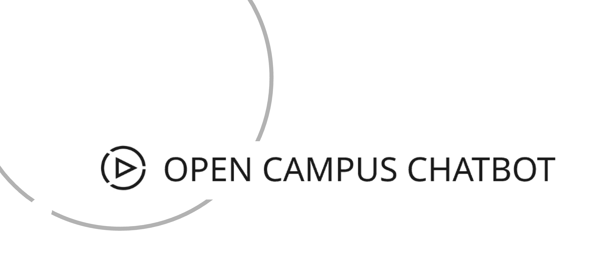

# OpenCampus-Chatbot
------------------------

Welcome to OpenCampus Bot! This is an intelligent chatbot designed to help you quickly find information about courses offered by OpenCampus. Whether you want to know what courses are available, get detailed information about a specific program, or compare two courses side-by-side, OpenCampus Bot is here to assist.

----
### Repository Link

[GitHub Repository](https://github.com/saimohit20/OpenCampus-Chatbot.git)

----

### Presentation Link

[Presentation](4_Presentation/Opencampusbot-ppt.pdf)

--------


-----------

## What is Opencampus Bot?

Opencampus Bot acts as your personal guide to OpenCampus courses. Instead of manually searching through the website, you can simply ask OpenCampus Bot your questions in plain language, and it will provide relevant answers based on the official course materials.

---

## Features

* **Course Listings:** Ask for a general list of courses or courses within specific categories (e.g., "What courses do you offer?", "Show me courses in Tech & Coding?").
* **Detailed Course Information:** Get comprehensive details about any specific course (e.g., "Tell me about Python Programming?", "What's the schedule for Machine Learning?").
* **Course Comparison:** Compare two courses side-by-side to see their descriptions, key learnings, ECTS credits, and more (e.g., "Compare R and Python?", "How is Web Development different from Data Science?").
* **Intelligent Understanding:** Uses advanced AI to understand your questions and find the most relevant information.

---

## How It Works


* **Chat:** You start by asking a question, for example, "What are courses available in Tech?"
* **Tool Agent:** The system analyzes your question to determine your intent and selects the right tool.
* **Prompt:** Based on your intent, the Agent identifies the relevant function or "tool" needed (e.g., "List Courses").
* **Tool Calling:** If you ask for courses in a specific category (like "tech"), the system gets ready to use the right function.
* **JSON Output:** The Agent creates a data message (in JSON format) telling the bot which tool to use ("list_courses_by_category") and what category to look in ("Tech & Coding").
* **Tool Action:** The chosen tool then does its job. In this example, it prepares a request to get all courses in the "Tech & Coding" category.
* **Response:** Finally, the bot gives you the answer, showing the available courses in the "Tech & Coding" category and follow up question.

------
## Project Structure
```bash
OpenCampus-Chatbot/
├── 0_Literature Review/          # Literature review and research notes
├── 1_scraping/                   # Web scraping scripts and raw course data
│   ├── domain_data/              # Scraped course data in JSON format
│   └── scraping_pipeline.py      # Script to scrape course data
├── 2_vector_store/               # Vector database and ingestion scripts
│   ├── faiss_index/              # FAISS vector index files
│   └── ingest_data.py            # Script to process and embed course data
├── 3_Model/                      # Main chatbot application and assets
│   ├── main.py                   # Streamlit app for the chatbot
│   └── opencampus_logo.png       # Logo for the app
├── 4_Presentation/               # Presentation materials
├── 5_results/                    # Results and reports
├── CoverImage/                   # Cover images for documentation
├── requirements.txt              # Python dependencies
└── README.md                    
```
-----

## Technologies Used

* **Python:** The main programming language.
* **Playwright:** For web scraping (simulating a browser).
* **LangChain:** A framework for building LLM applications.
* **FAISS:** For fast similarity search in the knowledge base.
* **Google Generative AI Embeddings:** To convert text into searchable numerical data.
* **Google Gemini / Ollama:** The powerful AI models that understand and generate text.
* **Streamlit:** For creating the interactive web application (the chat interface).

---

## How to Run Opencampus Bot (Quick Start)

To get EduBot up and running, you'll need Python installed and a few simple steps:

1.  **Get the Code:** Download or clone this project to your computer.
2.  **Install Dependencies:** Open your terminal or command prompt in the project folder and run:
    ```bash
    pip install -r requirements.txt
    ```
3.  **Set Your Google API Key:** Open `ingest_data.py` and `main.py`. Find the line `GOOGLE_API_KEY = "YOUR_GOOGLE_API_KEY"` and replace `"YOUR_GOOGLE_API_KEY"` with your actual Google API Key.
4.  **Gather Course Data:** Run the scraping script (this will create the `domain_data` folder and fill it with course info):
    ```bash
    python scraping_pipeline.py
    ```
5.  **Build the Knowledge Base:** Run the ingestion script (this will create the `faiss_index` folder):
    ```bash
    python ingest_data.py
    ```
6.  **Start the Chatbot:** Finally, launch the Streamlit application:
    ```bash
    streamlit run main.py
    ```
    Your opencampus chatbot will open in your web browser!

----------
## Future Works

* **Build End-to-End Data Pipeline:** Implement an automated pipeline to regularly fetch data from the website (monthly/weekly).

* **Enable Course Registration:** Integrate functionality for users to register for courses directly through the chatbot.

* **Integrate with Other LLMs:** Explore integration with additional Large Language Models beyond the current ones.

* **Channel Integration for Updates:** Connect with relevant channels to receive updates and answer common course-related questions.

-------------

**Note:** If you want to use local AI models (like Gemma or Llama), you'll also need to set up [Ollama](https://ollama.com/) and pull the models you want to use before running `main.py`.

---

---

Enjoy chatting with OpenCampus Bot!

